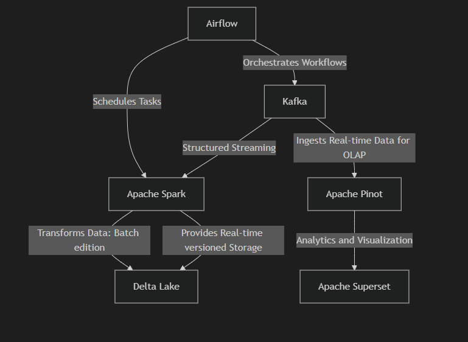

# Real-Time Ride Events Processing Pipeline

Took on this project because I was reading about Uber and decided to try out a ride sharing event pipeline, assuming I was to build one for my startup, this project implements a real-time data pipeline for processing ride-sharing events using Apache Kafka, Apache Spark, Apache Pinot (for streaming Analytics), Apache Superset for visualizations and Delta Lake, orchestrated with Apache Airflow.
(Needs Improvement though).

## Architecture Overview

The pipeline consists of the following components, check `assets/data-pipeline-graph.md`


A brief:

1. **Kafka Producers**
   - `ride_event_producer.py`: Generates ride events in Avro format
   - `ride_event_json.py`: Generates ride events in JSON format
   - `ride_summary_producer.py`: Produces ride summary events

2. **Apache Spark Processing**
   - Uses Spark Structured Streaming to consume Kafka topics
   - Processes and transforms ride event data
   - Writes data to Delta Lake tables

3. **Delta Lake Storage**
   - Provides ACID transactions and versioning
   - Enables time travel capabilities
   - Stores processed ride data in an optimized format

4. **Streaming to Apache Pinot (OLAP)**
    - Stream from Kafka to Apache Pinot for OLAP reasons.

5. **Data Visualization to Apache Superset**
    - Apache Pinot to Superset, (I am big into analytics also)

6. **Orchestrate with Airflow**

   - Apache Airflow to schedule and orchestrate Kafka
   - Schedule writing stream to delta lake.

--  **Setup Overview:**

Services are setup in `docker-compose.yml` edit for your choice, specifically apache-superset

## Setup Instructions

1. Make sure docker is running, and on your terminal, run:

   ```bash
   docker build -t custom-airflow .
   docker compose up -d 
   docker exec airflow-cli users --username USERNAME --firstname FIRST_NAME --lastname LASTNAME --email airflow@email.com --role Admin --password ******
   ```

2. Run your airflow DAGS on `localhost:8080` and trigger it:

    - `kafka_producer_dag` : Using Python Operator
    - `kafka_to_delta`: Using Bash Operator for Spark engine

3. Set up your Apache Pinot on `localhost:9000`, open SWAGGER API or use docker cli to add `AddSchema` and `AddTable`, you would find `schema.json` and `table.json` in `pinot_setup` folder.

4. Set up your Apache Superset, firstly you would want the Apache Pinot Driver installed, check [here](https://superset.apache.org/docs/configuration/databases/), open on `localhost:8088`  add Pinot configurations and you are good to go with visualizations.

--   Feel free to customize the docker file and compose.yml on how you would want it to run, also note Apache Superset configuration, check before spinning up the docker.

## Data Schema

### Ride Events

- ride_id (string)
- city (string)
- ride_type (string)
- start_time (timestamp)
- end_time (timestamp)
- duration_minutes (integer)
- distance_miles (float)
- fare_usd (float)
- driver_id (string)
- rider_id (string)

## Project Structure Overview

The project is organized into a directory structure that facilitates the management and execution of data processing workflows using Apache Airflow. Below is an overview of the key directories and their purposes:

```plaintext
airflow
└── dags
    ├── bronze
    ├── packages
    ├── random_delta
    └── spark_delta
```

### Directory Descriptions of Airflow

- **dags**: This directory contains Directed Acyclic Graphs (DAGs) that define the workflows for data processing. Each DAG is a collection of tasks that are executed in a specific order.

- **bronze**: This folder is intended for the initial stage of data processing, often referred to as the "bronze" layer. It typically contains raw data ingested from various sources before any transformations are applied.

- **packages**: This directory contains the code for producing and consuming Kafka messages. It supports both Avro and JSON formats, allowing for flexible data interchange between different components of the pipeline. The files in this directory handle the serialization and deserialization of data, ensuring that it can be processed correctly by downstream systems.

- **random_delta**: This folder contains local code that facilitates the transfer of data from Kafka to Delta Lake. It includes scripts and utilities that manage the ingestion and transformation of data, ensuring that it is stored in an optimized format for querying and analysis.

- **spark_delta**: This directory contains the `kafka_to_delta.py` script, which is responsible for running the Spark job that processes data from Kafka and writes it to Delta Lake. This script leverages Spark's structured streaming capabilities to handle real-time data processing, ensuring that data is continuously ingested and made available for analytics.

## Monitoring

- Monitor Kafka topics using:

  ```bash
  kafka-console-consumer.sh --topic ride-events --from-beginning
  ```

- Check Delta Lake tables using Spark SQL
- View processing metrics in Spark UI

## Contributing

1. Fork the repository
2. Create a feature branch
3. Submit a pull request

### Things that can be improved on

1. Testing Coverage
2. Monitoring through Grafana, DataDog
3. Data Quality Checks
4. More interesting data, more kafka topics events

## **Authors Note:**

I think to make this production ready, things like governance, security, cloud deployment and CI/CD would be put in place, this was just a fun side project. That I would also test out using different technologies such as Prefect, Dagster, Flink, S3 or Minio, and Terraform, and spice it up with monitoring and quality checks next time, and some other cool things. Important note is learn more about event processing and schema evolution, which Delta Lake solves with ~autoMerge~
the goal was to reduce my skill issues, mission accomplished. 

