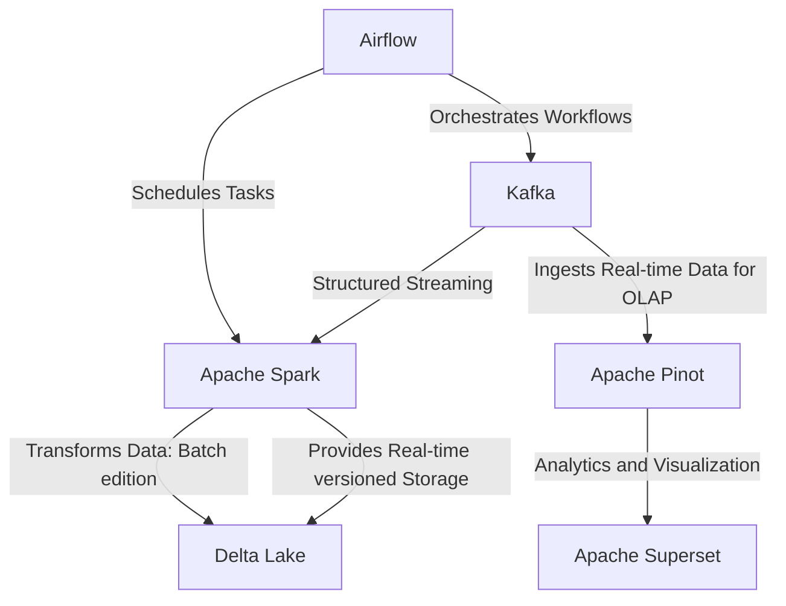

```mermaid
graph TD
    A[Kafka] -->|Structured Streaming| C[Delta Lake]
    A[Kafka] -->|Ingests Real-time Data for OLAP| F[Apache Pinot]
    C[Apache Spark] -->|Provides Real-time versioned Storage| B[Delta Lake]
    C -->|Transforms Data: Batch edition| B
    E[Airflow] -->|Orchestrates Workflows| A
    %% E -->|Manages Pipeline| B
    E -->|Schedules Tasks| C
    %% E -->|Triggers Visualization| D
    %% F[Great Expectations] -->|Data Quality Checks| B
    %% G[Prometheus] -->|Monitors Performance| A
    %% G -->|Tracks Metrics| C
    %% G -->|Logs Visualization| D
    F[Apache Pinot]-->|Analytics and Visualization| D[Apache Superset]
``` 

