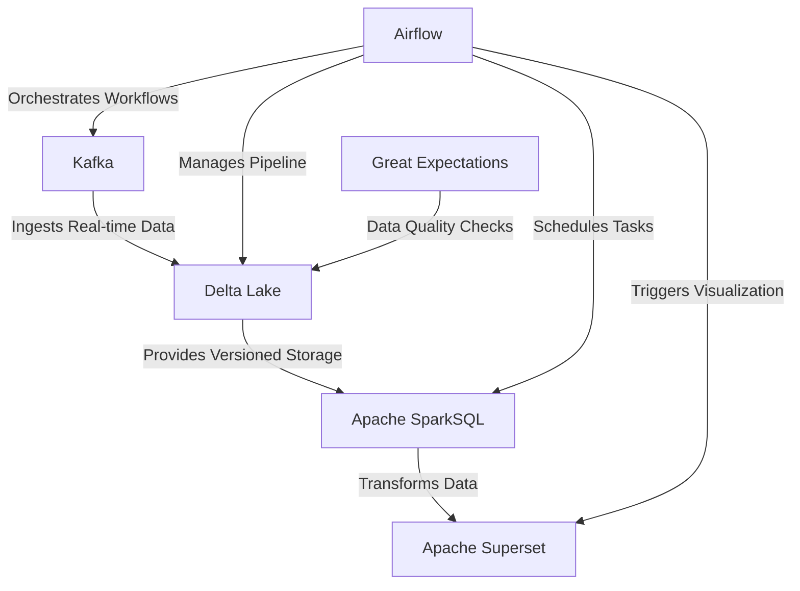

```mermaid
graph TD
    A[Kafka] -->|Ingests Real-time Data| B[Delta Lake]
    B -->|Provides Versioned Storage| C[Apache SparkSQL]
    C -->|Transforms Data| D[Apache Superset]
    E[Airflow] -->|Orchestrates Workflows| A
    E -->|Manages Pipeline| B
    E -->|Schedules Tasks| C
    E -->|Triggers Visualization| D
    F[Great Expectations] -->|Data Quality Checks| B
    %% G[Prometheus] -->|Monitors Performance| A
    %% G -->|Tracks Metrics| C
    %% G -->|Logs Visualization| D
``` 

